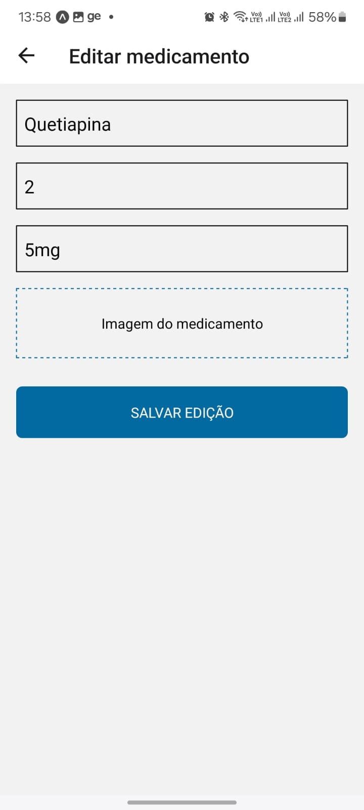

<link rel="stylesheet" href="https://cdnjs.cloudflare.com/ajax/libs/font-awesome/5.15.4/css/all.min.css" integrity="sha512-lBk1E0enM6jsnENk9P1qU7nOsnz2PlzoSqC+tlP2V0lRXYQ8lSHssK7ICVUmIT+cLkAgVkfiY4/So6PTV5zBkQ==" crossorigin="anonymous" referrerpolicy="no-referrer" />

# List Medease

Desnevolvimento de um aplicativo com o propósito de tornar mais simples a organização de informações e a prestação de serviços dos cuidadores aos pacientes.
O aplicativo deverá permitir:
- O cadastro de uma lista de medicamentos com fotos e dosagens dos medicamentos que serão administrados ao paciente conforme a prescrição médica;
- Gerenciamento e administração dos medicamentos no tempo correto, exibindo notificações referente ao medicamento a ser tomado e o horário; 
- Fazer a leitura dos batimentos cardiacos e saturação do sangue utilizando um smartwatch mi band como dispositivo de inserção de dados;
- Exibir gráficos com os dados coletados pelo dispositivo de inserção de dados 

## Índice

- [Instalação](#instalação)
- [Uso](#uso)
- [Imagens](#imagens)
- [Créditos](#créditos)
- [Contato](#contato)

## Instalação

Após baixar o projeto, acessar a pasta server e no terminal rodar o comando:   

`npm install`

Para acessar o Prisma Studio:   

`npx prisma studio`

## Uso

Na pasta server, no arquivo server.ts alterar o IP onde o servidor está rodando, para o seu IP na sua rede.

Abrir a pastar server e rodar o comando:  
`npx tsx server.ts`

Após isso o servidor estará rodando.

Na pasta mobile, rodar o comando:   

`npx expo start`

Fazer a leitura do QRCode no aplicativo Expo Go do seu celular e aguardar a inicialização do aplicativo.

Após isso o aplicativo já poderá ser utilizado.

## Imagens

Telas desenvolvidas até o momento:   

 

 

## Créditos

Grupo de Projeto Integrador 5 e 6 do curso de Engenharia da Computação na Univesp.

## Contato

Informações de contato para perguntas, problemas ou feedback.  

